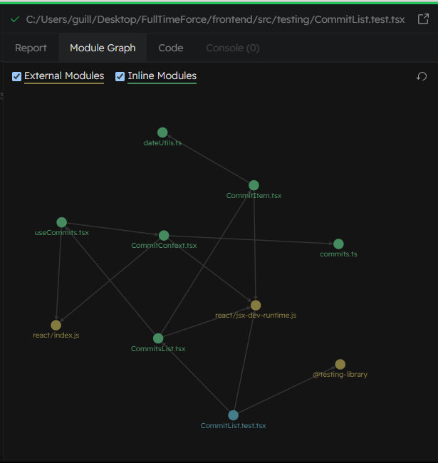

# FullTime Force Challenge

Description: An application that interacts with the GitHub API to display commit history, built using Nest.js + Vite - React both with TypeScript.

## Objective

The goal of this test is to create an app that displays the git commit history for the public repository associated with this project.

Link to the project repo on GitHub: [follow to the site](https://github.com/GuilloSGit/FullTime-Force)

### Technologies Used

```plaintext
    - Frontend: [React] + [TypeScript + SWC]
    - Backend: [NestJS] + [TypeScript ]
    - Deployment: [Railway]
```

You can find documentation on the GitHub API [here](https://developer.github.com/v3/).

### Assessed Requirements

1. **GitHub API Usage:** Utilize the GitHub API to retrieve the git commit history of the project. Avoid using scrapers or alternative methods.

2. **Public Repository:** Create a public GitHub repository for this project. This allows the recruitment team to review and verify the accuracy of my code. After completing the project, the repository link will be shared with take-home-test@fulltimeforce.com.

3. **Styling:** The page's style is open. I used Tailwind CSS. I adapted the styling based on business requirements.

4. **Backend Framework:** Utilize NestJS as the framework for the backend. I did not used Express.

5. **Real-time View:** The page does not have real-time updates. It is needed to refresh the page to fetch the latest commits from my repository.

6. **README Instructions:** Detailed instructions in the README on how to install and run your project.

### Instructions to fork and use this app

1. Fork this [repository](https://github.com/GuilloSGit/FullTime-Force/fork).

2. Open the main folder in a Terminal, like CMD or PowerShell or Bash.

3. Run the following command to install front and back packages and dependencies all in one prompt:
    ```bash
        node install.js
    ```
4. Open a terminal for backend folder (access with 'cd .\backend\' prompt).

5. Run this command:
    ```bash
        npm run start
    ```
6. Open a terminal for frontend folder (access with 'cd .\frontend\' prompt).

7. Run this command:
    ```bash
        npm run dev
    ```

### Additional Notes

**Unit Testing**

You can run all 9 tests from your .\frontend\ folder.

Open a terminal and run the next command:
```bash
    npm test
``` 

Test cases include:

- Format Commit Date Function Test
    - should format commit date correctly
    - should handle an invalid date string gracefully
    - should handle null input gracefully

- Commit Item Test
    - should have a profile picture with Alt Text with the user name on it
    - should NOT have a profile picture with Alt Text with the other name on it
    - should get node text correctly
    - should compute heading level correctly

- Commits List Test
    - should have a divition with data-testId named commit-item
    - should render commits items with correct data

You will be able to see graphics and metrics during test execution.




**Positive Experiences**

Learning GitHub API:

I discovered and learned about the GitHub API during this project, expanding my knowledge in this area. The experience was phenomenal and valuable for my professional development.

Exploring Tailwind CSS: Although I'm not very accustomed to using Tailwind CSS, I found this experience interesting. I learned to work with a less flexible but potentially efficient tool in certain contexts.

**Attempts and Challenges**

Adding Tests to the Backend: I attempted to add tests to the backend but faced challenges in installing packages and setting up the development environment. This experience motivated me to seek solutions and improve my understanding of unit testing on the backend.

Implementing the New Commits Alarm: I tried to implement an alarm for new commit events but encountered obstacles that prevented its completion. I learned about the complexities of integrating real-time functions and how to approach this aspect in future projects.

**Animations and Interactions**

I attempted to enhance the user experience through animations and interactions, but this goal remained incomplete. I learned the importance of balancing aesthetics with functionality and how to better plan future implementations.

**Limitations Due to Lack of Time**

Expanding Sections in the Application: I couldn't add more sections to the application due to time constraints. I would have liked to dedicate more time to expanding and enriching the application's functionality.

Closer Frontend-Backend Relationship: Due to time constraints, the interaction between the frontend and backend was limited to a single endpoint.

I recognize the potential for improving this integration to achieve a more robust and scalable application.

### Deployment

Back -> https://fulltime-force-back-production.up.railway.app/api/commits

Front -> https://fulltime-force-front-production.up.railway.app/
